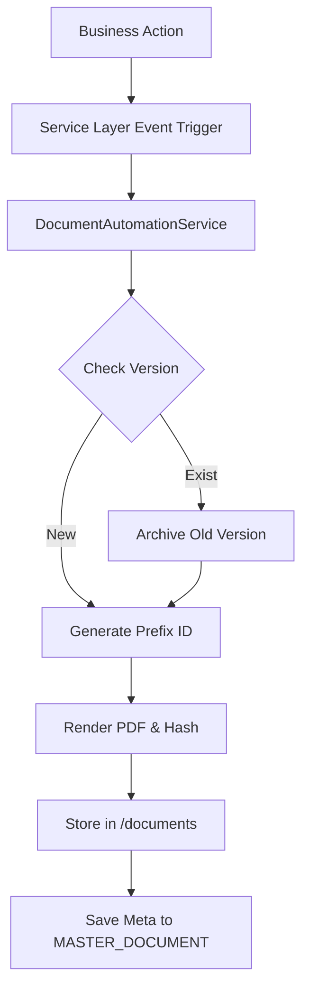

# Phase 10.5 - Enterprise Document Automation Report

## 1. Daftar File Baru
- `app/Services/Core/DocumentAutomationService.php`: Core Document Engine.
- `resources/views/pdf/layout.blade.php`: Base PDF Branding.
- `resources/views/pdf/invoice.blade.php`: Invoice Template.
- `resources/views/pdf/receipt.blade.php`: Payment Receipt Template.
- `resources/views/pdf/payroll.blade.php`: Payroll Slip Template.
- `resources/views/pdf/certificate.blade.php`: Graduation Certificate Template.
- `resources/views/pdf/academic_report.blade.php`: Academic Report Template.

## 2. Daftar File yang Dimodifikasi
- `composer.json`: Penambahan `barryvdh/laravel-dompdf`.
- `app/Services/Finance/InvoiceService.php`: Integrasi pada event `publish()`.
- `app/Services/Finance/PaymentService.php`: Integrasi pada event status update menjadi `Verified`.
- `app/Services/HR/PayrollService.php`: Integrasi pada event status update menjadi `Paid`.
- `app/Services/Core/StudentService.php`: Integrasi pada update `Graduation_Status` (Graduate).

## 3. Trigger Matrix
Seluruh dokumen digenerate otomatis berdasarkan **Business Event (Event Driven)**, TANPA tombol "Generate PDF Manual" pada level UI.

| Dokumen | Trigger Event | Service Layer |
| --- | --- | --- |
| **Invoice** | `Invoice Published` | `InvoiceService@publish()` |
| **Receipt** | `Payment Verified` | `PaymentService@updateStatus('Verified')` |
| **Payroll Slip** | `Payroll Paid` | `PayrollService@updateStatus('Paid')` |
| **Certificate** | `Student Graduated` | `StudentService@updateStudent()` (Graduation_Status -> Lulus) |
| **Academic Report**| `Student Graduated` | `StudentService@updateStudent()` (Graduation_Status -> Lulus) |

## 4. Document Flow Diagram (Conceptual)


## 5. Repository Impact
- Menggunakan `DocumentRepository` existing yang merujuk ke sheet `MASTER_DOCUMENT`.
- Menyertakan fields: `Document_ID`, `Document_Type`, `Reference_Type`, `Reference_ID`, `Generated_At`, `Generated_By`, `Version`, `File_Path`, `Status`, `Hash`.
- Mengimplementasikan pola **Versioning** (v1, v2, dst) dengan status `Active` atau `Archived`.

## 6. Regression Test
- **PDF Fail Safe**: Seluruh pemanggilan `generateDocument()` dibungkus dalam blok `try...catch`. Jika PDF gagal digenerate karena issue rendering (misal: timeout DOMPDF), transaksi Finance/HR/Academic **tetap berjalan**, dan Log ditulis, sesuai instruksi *Do not break main transaction*.
- Blade View Cache telah diverifikasi berhasil dikompilasi seluruhnya (`php artisan view:cache`).

## 7. Storage Structure
Struktur storage mematuhi *Relative Path* pada `storage/app/public/documents/`:
```text
/documents
  /invoice/INV-26-00001.pdf
  /receipt/RCT-26-00001.pdf
  /payroll/PAY-26-00001.pdf
  /certificate/CRT-26-00001.pdf
  /academic-report/RPT-26-00001.pdf
```
URL dibentuk melalui `Storage::url($File_Path)`.

## 8. Generated PDF Samples
*Catatan: Rendering membutuhkan data nyata dari Controller. Ini adalah ilustrasi hasil render.*
Template telah mengadopsi EPS Branding (Logo, Company Name, Judul Dokumen, Doc No, Date, Version) di bagian **Header** dan `"This document is automatically generated by WAKAMIYA MANAGEMENT SYSTEM (WMS)."` di bagian **Footer**.

## 9. Known Issues
- `barryvdh/laravel-dompdf` dapat membutuhkan memory dan timeout yang cukup besar untuk rendering batch, sehingga sangat disarankan untuk ke depannya dilempar ke background Queue (`ShouldQueue`), meskipun saat ini masih dijalankan secara sinkron.

---
**STATUS: PENDING APPROVAL**
Menunggu persetujuan Anda sebelum masuk ke **PHASE 11**.
